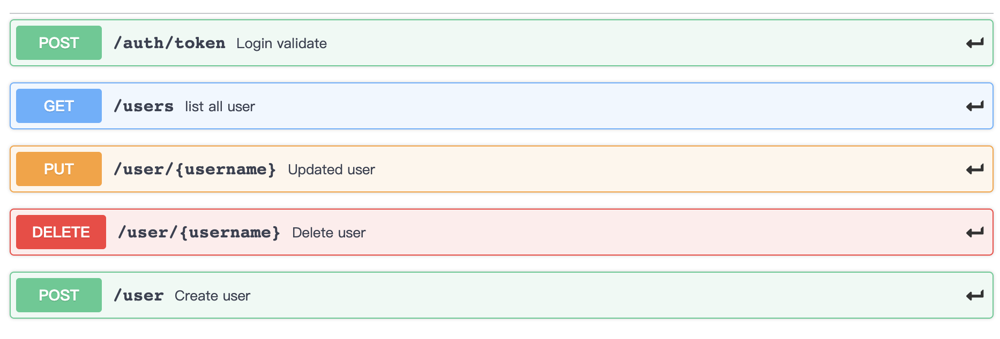

## openshift-basic-identity-provider

* 可作为openshift basic remote identity provider为openshift提供用户认证
* 目前使用splite作为数据存储，之后会换成mysql或其他数据库

## API

以下是目前支持的api



详细接口信息可以使用项目内`swagger.yaml`文件在**swagger hub**中查看

### 数据表结构

```sqlite
type User struct {
	ID uint `json:"id,omitempty"gorm:"primary_key;AUTO_INCREMENT"`

	Username string `json:"username"gorm:"unique;not null"`

	Password string `json:"password,omitempty"`

	Email string `json:"email,omitempty"`

	Name string `json:"name,omitempty"`

	Sub string `json:"sub,omitempty"gorm:"-"`

	PreferredUsername string `json:"preferred_username,omitempty"gorm:"-"`
}
```

## how to start

### Ansible自动部署

- 请确保你的openshift的目录上存在目录 `/etc/origin/master/custom_auth`

- 使用openssl自签证书，用于openshift identity配置以及应用route使用，可参考[这篇文章，注意签名中的域名换成你自己的](http://gitlab.sh.99cloud.net/openshift_origin/openshift-authentication-extension/tree/master)

- 请确保修改你的openshift配置文件在 `/etc/origin/master/master-config.yaml`, 中间的oauth的配置样板如下

  ```yaml
  oauthConfig:
    assetPublicURL: https://openstack-vm2-master.demotheworld.com:8443/console/
    grantConfig:
      method: auto
    identityProviders:
    - name: my_remote_basic_auth_provider
      challenge: true
      login: true
      mappingMethod: add
      provider:
        apiVersion: v1
        kind: BasicAuthPasswordIdentityProvider
        url: https://basic-identity--myproject.openstack-vm2-apps.demotheworld.com/openshift-basic-identity-provider/1.0.0/auth/token
        ca: /etc/origin/master/custom_auth/ca.crt
        certFile: /etc/origin/master/custom_auth/admin.crt
        keyFile: /etc/origin/master/custom_auth/admin.key
  ```

  其中,url为本应用route的https域名，应用的restful接口前缀为`openshift-basic-identity-provider/1.0.0`

- 根据`ansible/inventory.example`的注释更改相应参数

- 执行`ansible-playbook -i inventory.example site.yml`

### 容器运行

* git clone 本项目，需要本地环境有``docker`及`go`

* `docker build -t imagename:tag .`
* `docker run -d -p port:8080 imagename:tag`

### openshift运行

#### 使用storage class

* 编辑项目下`openshift/template/tmpl-use-sc.json`中的参数
* `oc new-app -f openshift/template/tmpl-use-sc.json`

#### 使用已有pv运行

* `oc new-app -f openshift/template/tmpl.json`

### 本地测试

替换url中的`yourdomain`

* list user

  `curl -X GET "http://yourdomain/openshift-basic-identity-provider/1.0.0/users" -H "accept: application/json"`

* create user

  `curl -X POST "http://yourdomain/openshift-basic-identity-provider/1.0.0/user" -H "accept: application/json" -H "Content-Type: application/json" -d "{ \"password\": \"john\", \"username\": \"john\"}"`

* update user

  `curl -X PUT "http://yourdomain/openshift-basic-identity-provider/1.0.0/user/john" -H "accept: application/json" -H "Content-Type: application/json" -d "{ \"password\": \"john\", \"name\": \"john\", \"email\": \"somebody@gmail.com\", \"username\": \"john\"}"`

* delete user

  `curl -X DELETE "http://yourdomain/openshift-basic-identity-provider/1.0.0/user/john" -H "accept: application/json"`


### to do list

- [x] 错误处理及返回
- [ ] 统一日志输出
- [x] 数据库字段加密
- [x] ansible 部署
- [ ] api认证
- [ ] swagger ui 显示api详情

